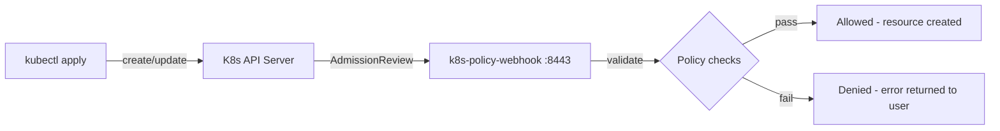

# k8s-policy-webhook

A Kubernetes **validating admission webhook** written in Go that enforces deployment policies at the cluster level. When a Pod or Deployment is created/updated, this webhook intercepts the request and rejects it if it violates any configured policy.

Think of it as a lightweight, self-hosted alternative to OPA Gatekeeper or Kyverno — focused, fast, and easy to extend.

## Policies enforced

| Policy | What it catches | Why it matters |
|--------|----------------|----------------|
| **Block `:latest` tag** | Rejects untagged images or `:latest` | Prevents non-reproducible deployments |
| **Require resource limits** | Rejects containers without CPU/memory limits | Prevents noisy-neighbor resource starvation |
| **Require labels** | Rejects pods missing mandatory labels (e.g. `app`, `owner`) | Enforces ownership and observability |
| **Block privilege escalation** | Rejects privileged containers or `allowPrivilegeEscalation: true` | Hardens runtime security posture |
| **Block registries** | Rejects images from untrusted registries | Supply chain security |
| **Max replica count** | Caps Deployment replicas | Prevents accidental resource explosion |
| **Exempt namespaces** | Skips checks for system namespaces | Avoids breaking core cluster components |

All policies are configurable via a YAML file — toggle each one on/off independently.

## Architecture



The webhook runs as a Deployment inside the cluster. The Kubernetes API server sends every Pod/Deployment create/update request to it as an `AdmissionReview`. The webhook validates against the configured policies and returns allow/deny.

## Project structure

```
.
├── cmd/webhook/main.go              # Server entrypoint, TLS, graceful shutdown
├── internal/
│   ├── config/config.go             # Policy YAML loader + defaults
│   ├── handler/handler.go           # HTTP handler, AdmissionReview processing
│   └── validator/
│       ├── validator.go             # Core validation logic
│       └── validator_test.go        # Unit tests (30+ test cases)
├── deploy/
│   ├── policy.yaml                  # Example policy configuration
│   └── helm/                        # Helm chart for production deployment
│       ├── Chart.yaml
│       ├── values.yaml
│       └── templates/
│           ├── deployment.yaml
│           ├── service.yaml
│           ├── webhook.yaml         # ValidatingWebhookConfiguration
│           └── configmap.yaml       # Policy config as ConfigMap
├── hack/gen-certs.sh                # Self-signed TLS cert generator for local dev
├── .github/workflows/ci.yaml       # CI: test → lint → build → push to GHCR
├── Dockerfile                       # Multi-stage build (distroless, nonroot)
└── go.mod
```

## Quick start (local)

**Prerequisites:** Go 1.22+, Docker, a running Kubernetes cluster (Minikube/Kind), `kubectl`, `openssl`

```bash
# 1. Clone
git clone https://github.com/Arnav1511/k8s-policy-webhook.git
cd k8s-policy-webhook

# 2. Run tests
go test -v ./...

# 3. Generate self-signed TLS certs for local testing
chmod +x hack/gen-certs.sh
./hack/gen-certs.sh certs

# 4. Build and run locally (outside cluster, for testing)
go build -o webhook ./cmd/webhook
./webhook --cert=certs/tls.crt --key=certs/tls.key --config=deploy/policy.yaml --port=8443

# 5. Test with a sample admission review
curl -k -X POST https://localhost:8443/validate \
  -H "Content-Type: application/json" \
  -d @hack/test-admission-review.json
```

## Deploy to cluster (Helm)

```bash
# 1. Build and push the image
docker build -t ghcr.io/arnav1511/k8s-policy-webhook:v1 .
docker push ghcr.io/arnav1511/k8s-policy-webhook:v1

# 2. Create TLS secret (or use cert-manager in production)
./hack/gen-certs.sh certs
kubectl create secret tls k8s-policy-webhook-tls \
  --cert=certs/tls.crt --key=certs/tls.key -n default

# 3. Install via Helm
helm install k8s-policy-webhook deploy/helm/ \
  --set image.tag=v1

# 4. Verify
kubectl get pods -l app=k8s-policy-webhook
kubectl get validatingwebhookconfigurations
```

## Test it

After deploying, try creating a pod that violates policies:

```bash
# This should be REJECTED (no tag, no resource limits, no labels)
kubectl run bad-pod --image=nginx

# This should be ALLOWED
kubectl apply -f - <<EOF
apiVersion: v1
kind: Pod
metadata:
  name: good-pod
  labels:
    app: demo
    owner: arnav
spec:
  containers:
    - name: web
      image: nginx:1.25.3
      resources:
        limits:
          cpu: 100m
          memory: 128Mi
      securityContext:
        allowPrivilegeEscalation: false
EOF
```

## Configuration

Edit `deploy/policy.yaml` or the Helm ConfigMap to customize policies:

```yaml
blockLatestTag: true
requireResourceLimits: true
requireLabels:
  - app
  - owner
blockedRegistries:
  - "untrusted.io/"
blockPrivilegeEscalation: true
maxReplicaCount: 50
exemptNamespaces:
  - kube-system
  - argocd
```

## Tech stack

- **Go 1.22** — webhook server, validation logic, structured logging
- **Kubernetes admission API (v1)** — AdmissionReview request/response
- **Helm** — packaging and deployment
- **GitHub Actions** — CI pipeline (test, lint, build, push to GHCR)
- **Distroless** — minimal, secure container image
- **zap** — structured logging

## Author

**Arnav Ranjan** — DevOps Engineer | [LinkedIn](https://www.linkedin.com/in/arnav-ranjan-89162320a/) | [GitHub](https://github.com/Arnav1511)
